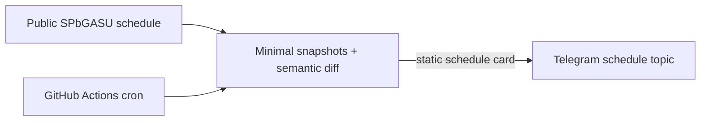

# Architecture

## Selected shape

The selected v1 is a stateless Python 3.12 schedule publisher executed by GitHub Actions.
No VPS, always-on home computer, database, inbound endpoint, or Telegram update receiver
is used. A scheduled CI job makes one outbound request flow to the public schedule source,
sends one Telegram card, and exits.

## Runtime processes

The selected workflow contains only:

- checkout and Python setup;
- installation of the project package;
- one public schedule fetch and parity calculation;
- one outbound Telegram `sendMessage` call.

The dormant local `full` profile still contains the prior poller/archive/material/attendance/AI
implementation for possible future work. It is not part of the selected release.

Health is a separate local CLI/systemd-timer read of durable state; there is no HTTP
endpoint. Opt-in document extraction has bounded file/page/pixel/cell/text/time limits and
a single material worker so expensive parsing never runs in the update acknowledgement
path. It is disabled by default: the current parser thread is not a killable OS sandbox,
and OCR is not implemented. Deployed-host isolation and malicious-corpus staging are still
required before extraction can be a production security boundary.

## Reliability contracts

### Incoming updates (`full` profile only)

1. Receive an update through long polling with an explicit allowlist.
2. Insert raw update under a unique bot-instance/update-ID key.
3. Only after durable insert, advance processing.
4. Business handlers use unique domain keys and short transactions.
5. Telegram sends are written to an outbox with an idempotency key.
6. Sender records the resulting Telegram message ID before marking the outbox row complete.

These contracts do not run in `schedule_only`. That profile clears pending updates at
startup and never requests later updates.
Telegram and SQLite cannot share one transaction: a crash after Telegram accepts a send
or copy but before step 6 commits can still create a duplicate on retry. The contract is
at-least-once with semantic idempotency and recorded destination IDs, not exactly-once.

### Scheduled work

Jobs have a unique semantic key, due time, state, attempt count, and bounded lease. A worker crash releases work after lease expiry. Publication rows are unique by `(kind, target, semantic_key)`, so a 20:29→20:32 restart creates one evening card, not zero or four.

### Schedule freshness

Every successful official response becomes an immutable snapshot with fetch time, source version/hash, and parsed lessons. The published card points to its snapshot. An outage serves the last confirmed snapshot with its age; it never labels cache as freshly confirmed. Only semantic user-facing changes create notifications.

## Data and search

SQLite is appropriate for one runtime process and this group's load. Core, material,
update, and outbox loops use short transactions while SQLite serializes actual writers;
there is no second database-writer process. Use local SSD only, `busy_timeout`, controlled
checkpoints, and foreign keys. WAL is enabled only when `sqlite_version()` is 3.51.3+ or
an explicitly verified 3.50.7/3.44.6 backport because of the 2026 WAL-reset corruption
bug documented in [SQLite WAL](https://sqlite.org/wal.html#the_wal_reset_bug). The current
local runtime is SQLite 3.53.1.

FTS5 stores exact text and an application-normalized Russian form: NFKC, casefold, `ё→е`, punctuation normalization, Snowball stems, and configurable group/discipline aliases. BM25 plus author/topic/date/type filters is the v1 retrieval baseline. Embeddings are added only if an evaluation set proves repeated semantic misses; they are not required merely because the system uses RAG. [SQLite FTS5](https://sqlite.org/fts5.html).

Original Telegram `file_id`/`file_unique_id`, message metadata, extracted text, an explicit
`needs_ocr` state, and content hashes are stored. Supported live documents are downloaded
only for bounded processing and removed from the private temporary area afterward. No OCR
text or permanent original-file copy is produced by the current live pipeline.

## Module boundaries

- `telegram`: transport models, allowed updates, topic registry, membership check, outbox sender;
- `schedule`: source adapter, parser, snapshots, semantic diff, renderer, publication jobs;
- `attendance`: lesson card/session lifecycle, reaction ledger, headman summary;
- `archive`: live message/edit ingestion and Telegram Desktop import;
- `materials`: candidate collection, classification, non-destructive copy/verify, and bounded extraction;
- `search`: Russian normalization, FTS/BM25 retrieval, context expansion;
- `ai`: replaceable provider, bounded retries, schema validation, usage metering;
- `assistant`: membership gate, conversation state, retrieval/tool orchestration, source links;
- `storage`: schema, migrations, inbox/outbox/jobs, backup hooks;
- `app`, `health`, `backup`, and owner CLI: composition, durable diagnostics, recovery,
  fixed-code alerts, and safe operator commands.

No module calls Telegram or AI directly from a database transaction. External effects cross the outbox/provider boundaries.

## Security and privacy boundaries

- Telegram bot token, AI key, university session, backup key, and cloud credentials are environment/secret-store inputs and are redacted from representations and logs.
- Group-history access requires a current `getChatMember` result and fails closed on timeout/unknown status.
- Deep-link payloads are opaque, short-lived nonces without user/group data.
- AI receives only bounded retrieved snippets needed for the question, never the raw archive.
- File parsing treats every upload as untrusted: MIME/magic validation, decompression
  limits, cooperative deadlines, one job, macros disabled, and a private temporary path.
  It remains disabled until a separately isolated, killable deployed worker is proven.
- Source deletion, topic deletion/rename, permission changes, bulk publication, bans, and production data migration remain approval-gated.
- Logs contain IDs and metadata needed for diagnosis but not tokens, cookies, full private prompts, or full documents.

## Deployment and rollback

Deploy a versioned wheel or source artifact to a non-root service account, run migrations, execute a configuration doctor, start under systemd, verify health and Telegram connectivity, and only then enable scheduled publications. Rollback stops the service, restores the previous artifact, and runs only a documented backward-compatible migration path; database restore uses a separately verified backup.

Production selection remains blocked until the candidate host passes:

- SPbGASU HTTP request from the actual host;
- Telegram polling and file-download checks;
- restart and duplicated-job tests;
- CPU/RAM/disk/packet-loss burn-in;
- encrypted backup plus full restore;
- staging acceptance and Codex Security audit.
